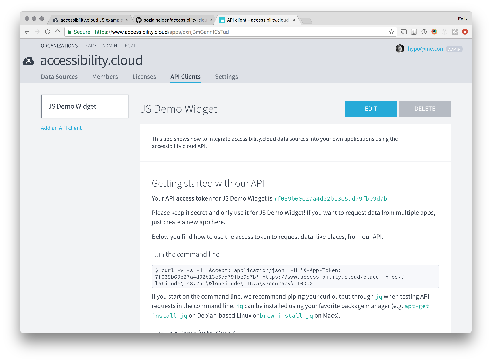
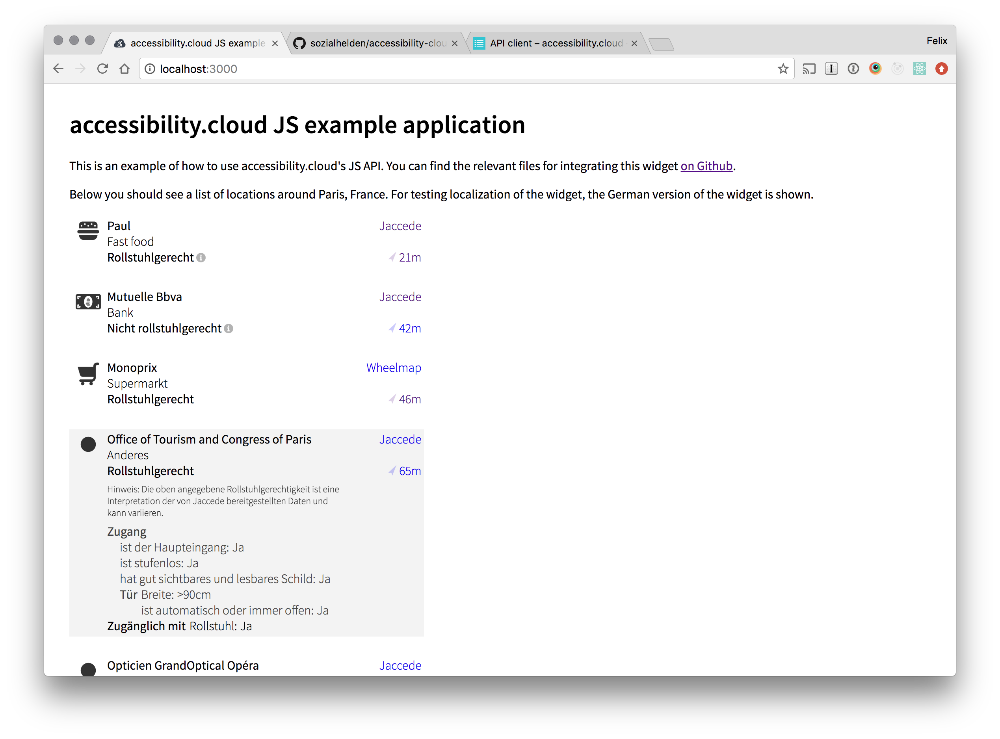

# accessibility.cloud – JavaScript widget

First: [Look at our demo!](https://sozialhelden.github.io/accessibility-cloud-js/)

This is a small and easy-to-use browser JS library. It…

- fetches data from [accessibility.cloud](https://www.accessibility.cloud) via its API
- displays a nice-looking, usable, accessible results list
- provides detail links to data providers
- shows distance and an OpenStreetMap link for each PoI
- handles attribution / credits as required by licenses

It is easy to include in any website or web app. If you have a React.js app, you can use it as a
standard React.js component via npm.


## Running the example

Right now the sourcecode of the example integration resides [on GitHub](https://github.com/sozialhelden//tree/master/public/js-example).
To include the widget into your application or website, you have to go through the following steps:

### Sign up / in

- Open https://www.accessibility.cloud
- Click *Sign up* or *Login*

### Obtain an API token

- Create an organization
- Fill out and submit the organization form and submit. You will be forwared to the organization
  view.
- Click "API Clients" in the header
- Click "Add API client", fill out and submit the form.
- Copy your *API access token*.
  

### Run the client

- Clone or [download the repository](https://github.com/sozialhelden/accessibility-cloud-js/archive/master.zip).
- Open `index.html` with your favorite text editor and replace the *API token* around line 22 with
  the one you copied from the API token page.
- Open `index.html` in your web-browser. The result should look similar to this:
  


## Comments on the code

### [build/example/index.html](./build/example/index.html)

This is a very short file. Its main purpose is to execute the following script:

```html
<script>
  $(function() {
    var accessibilityCloud = new AccessibilityCloud({
      token: '7f039b60e27a4d02b13c5ad79fbe9d7b', // <-- Replace this token with your own
      locale: 'de' // <-- Replace this with the locale you want to use
    });

    var element = document.querySelector('.ac-results');

    // These parameters are passed to the JSON API's GET /place-infos endpoint.
    // More documentation is here:
    // https://github.com/sozialhelden/accessibility-cloud/blob/master/docs/json-api.md#get-place-infos
    var parameters = {
      latitude: 40.728292,
      longitude: -73.9875852,
      accuracy: 10000,
      limit: 100,
    };

    accessibilityCloud.loadAndRenderPlaces(element, parameters, console.log);
  });
</script>
```

Note that the script above includes the API token, which you have to replace with the one you get on
[accessibility.cloud](https://acloud.eu.meteorapp.com) for your own API client. It also includes an
example request (in this case for places in Manhattan).

The `loadAndRenderPlaces` function renders the results in the given element. It optionally accepts a
callback in NodeJS `function (error, result) { … }` style.

For more information on the available parameters, refer to the
[documentation on the API](https://github.com/sozialhelden//blob/master/docs/json-api.md).


### accessibility.cloud.js

This is the library's main file. It includes a few library and is built and minified using webpack.


### Building the library yourself

- [Install yarn](https://yarnpkg.com/en/docs/install)
- Set up the build toolchain with `yarn install`
- Run `yarn start` to test the functionality and start developing
- Run `yarn build` to create a minified build in the `build/` directory
- Run `yarn version [major|minor|patch]` to create a new library version
- This is an ‘ejected’ `create-react-app` application. [Read more about `create-react-app`](https://github.com/facebookincubator/create-react-app/blob/master/packages/react-scripts/template/README.md)
  to understand the app's structure and internal build processes.


## Adding / changing translations

### Translation process

Translations are created using [transifex](https://www.transifex.com/sozialhelden/accessibility-cloud/js-widget/).

You can add translations by using [c3po](c-3po.js.org)'s `t` function in the code.

When you build a new version with `yarn build` or when you create a new version with `yarn version
[major|minor|patch]`, translations are automatically synced with transifex.

### How translation syncing works internally

- Pushing translations: When building with in development, the C3PO library creates a PO template
file (`src/i18n/translations.pot`) with all found strings used as arguments to the `t` function.
This file is pushed to transifex with `tx push -s src/i18n/translations.pot`.
- Pulling translations: When all strings are translated there, you can build a new version with
`yarn build`, which runs `tx pull -a`. This downloads the translations from transifex and stores
them as `.po`-Files in the `src/translations/` directory. `.po` files can be imported using the
`po-gettext-loader` Babel plugin.
